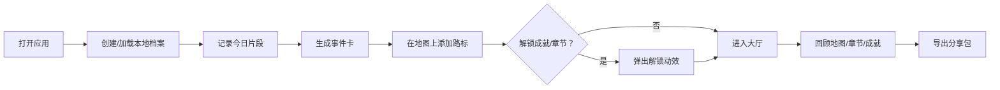

# Evertrail 产品需求文档（PRD）

## 1. 产品概述

Evertrail 是一款**本地优先**的像素风人生旅行网页游戏。用户通过每日或不定期的“打卡”记录文字、图片与心情，系统将这些真实生活片段转化为可探索的游戏世界：事件卡、人生地图、章节回忆与成长成就。用户既可以随时回看自己的旅程，也能导出一个独立的可分享网页游戏，让他人像玩 Terraria 一样在像素世界中体验这段独特人生。

- 解决的核心问题：传统日记回顾枯燥、缺乏情感反馈；朋友圈记录又过于公开。
- 目标用户：喜欢叙事、收藏与轻度游戏化的普通记录者，尤其是希望把私人记忆“玩起来”的人。

## 2. 核心功能

### 2.1 用户角色

| 角色 | 注册/进入方式 | 核心权限 |
|------|---------------|----------|
| 本地玩家 | 无需注册，输入昵称并选择头像种子即可开始 | 创建记录、查看地图/章节/成就、导出分享包 |

### 2.2 功能模块

1. **旅程大厅（Dashboard）**：今日打卡入口、连续打卡天数、最近人生地图缩略图、成就摘要。
2. **记录页（Journal）**：创建/编辑日志；选择心情、标签、图片；实时预览生成的事件卡。
3. **人生地图（World Map）**：2D 像素横版卷轴地图，每个日志是一座路标；点击路标查看事件卡，地图随记录自动延伸。
4. **章节回忆（Chapters）**：按阶段聚合日志，生成章节标题与封面；支持“播放”章节幻灯片。
5. **成长与成就（Growth）**：等级、经验值、徽章、连续打卡、数据统计。
6. **导出与分享（Export）**：一键生成单文件 HTML 游戏包，内含可玩地图与加密/公开选项。
7. **分享游玩页（Shared Journey）**：导出包中的独立页面，访客无需安装即可体验。

### 2.3 页面详情

| 页面名称 | 模块名称 | 功能描述 |
|----------|----------|----------|
| 旅程大厅 | 今日打卡 | 快速输入文字/心情/标签，上传可选图片，完成打卡 |
| 旅程大厅 | 状态面板 | 显示连续天数、当前等级、最近心情分布、最近事件卡 |
| 旅程大厅 | 快捷入口 | 进入地图、章节、成就、导出的按钮 |
| 记录页 | 编辑器 | 日期选择、多行文本、心情单选、标签多选、图片上传 |
| 记录页 | 事件卡预览 | 根据内容长度/心情/标签自动计算稀有度与属性 |
| 人生地图 | 游戏画布 | 像素横版世界， procedurally generated 地形与生物群系 |
| 人生地图 | 路标交互 | 点击路标弹出事件卡；双击打开编辑 |
| 人生地图 | 镜头控制 | 拖拽/滚轮缩放、自动跟随最新路标 |
| 章节回忆 | 章节列表 | 按时间/记录数聚合的章节卡片，显示标题与主题色 |
| 章节回忆 | 幻灯片播放 | 以像素过场动画依次展示章节内的事件卡 |
| 成长与成就 | 徽章墙 | 已解锁与未解锁成就，点击查看解锁条件 |
| 成长与成就 | 统计面板 | 记录总数、情绪分布、最常出现标签、最长连续 |
| 导出与分享 | 打包设置 | 选择公开/加密、填写旅程标题与简介 |
| 导出与分享 | 生成下载 | 输出单 HTML 文件，包含数据与可玩代码 |

## 3. 核心流程

用户首次打开应用后，创建一个本地档案（昵称 + 头像种子）。之后每天进入“记录页”写下当天的片段，选择心情与标签， optionally 上传图片。提交后：

1. 生成一张**事件卡**（稀有度、属性、心情视觉）。
2. 在**人生地图**上新增一个路标，并延伸对应的像素地形。
3. 检查是否满足新成就或新章节条件，若有则弹出解锁动效。
4. 用户可在地图、章节、成就中回顾；随时导出为独立 HTML 分享给他人。

## 4. 游戏机制设计

### 4.1 记录即“前进”

- 每次记录 = 在世界中前进一步。
- 事件卡的稀有度由内容长度、是否含图片、标签数量、情绪强度共同决定（1-5 星）。
- 事件卡附带四项“灵魂属性”：
  - **活力 Vitality**：与积极情绪、运动/户外标签相关。
  - **洞察 Insight**：与反思、学习、工作标签相关。
  - **联结 Connection**：与家庭、朋友、爱情标签相关。
  - **冒险 Adventure**：与旅行、挑战、新事物标签相关。
- 这些属性仅用于视觉反馈与成就解锁，不做数值攀比。

### 4.2 人生地图

- 横版像素世界，每个路标之间的地形使用 Simplex Noise 按内容哈希生成，保证同一段记忆 sempre 同一片风景。
- 路标生物群系由当天主导情绪决定：
  - 开心 → 阳光草地 / 金色麦田
  - 平静 → 湖泊 / 晨雾森林
  - 难过 → 雨夜沼泽 / 幽蓝洞穴
  - 愤怒 → 熔岩裂谷 / 雷暴荒原
  - 疲惫 → 灰色废墟 / 沉睡沙漠
  - 焦虑 → 扭曲迷宫 / 紫色迷雾
- 路标外观：日期 + 心情 emoji + 稀有度光环。
- 镜头：默认跟随最新路标，用户可自由拖拽探索过去。

### 4.3 章节回忆

- 每累计 7 条记录或自然月切换时，自动生成一个章节。
- 章节标题由该阶段高频情绪 + 高频标签生成，例如“春日迷途：工作与孤独”、“盛夏冒险：旅行与重逢”。
- 章节封面为像素场景合成图。
- “播放章节”以缓慢镜头移动 + 事件卡依次浮现的方式呈现，类似可交互幻灯片。

### 4.4 成长成就

| 徽章名称 | 解锁条件 | 视觉 |
|----------|----------|------|
| 七日行者 | 连续记录 7 天 | 像素脚印徽章 |
| 百味人生 | 使用过 6 种不同心情 | 调色盘徽章 |
| 光影旅人 | 记录中包含 10 张图片 | 相机徽章 |
| 长篇史诗 | 单条记录超过 200 字 | 卷轴徽章 |
| 标签收集者 | 使用过 20 个不同标签 | 图鉴徽章 |
| 心之守护者 | 一个月内每天记录 | 心形徽章 |
| 故事讲述者 | 导出过一次分享包 | 羽毛笔徽章 |

### 4.5 分享包（让别人“玩游戏”）

- 导出产物是一个**单 HTML 文件**，内嵌：
  - 被分享者的旅程数据（JSON）。
  - 精简版人生地图渲染引擎。
  - 章节播放与事件卡阅读逻辑。
- 可选公开或密码加密：公开包直接打开；加密包需输入密码后在前端解密（AES-GCM，密码由分享者设置）。
- 分享者界面提供“复制文件”或“下载”。

## 5. 用户界面设计

### 5.1 设计风格

- **视觉方向**：Terraria 式 2D 像素风，但 UI 更柔和、叙事感更强。
- **主色板**：
  - 深林绿 `#1a2f23`：背景与厚重感
  - 土壤棕 `#5c4033`：地形与边框
  - 金光 `#f4c430`：强调、稀有度、成就
  - 天空蓝 `#87ceeb`：平静、信息
  - 情绪色：开心 `#ffd700`、平静 `#87ceeb`、难过 `#6a5acd`、愤怒 `#ff4500`、疲惫 `#808080`、焦虑 `#ff8c00`
- **按钮**： chunky pixel 按钮，2px 实线边框，按下时整体偏移 2px 并变暗。
- **字体**：
  - 标题/数字：Google Fonts `Press Start 2P`（英文标题） + `ZCOOL KuaiLe`（中文大标题）
  - 正文：`Noto Sans SC`
  - 数字/小标签：`VT323`
- **布局**：顶部 HUD（昵称、等级、连续天数、操作按钮），中间为游戏画布/内容区，底部为可收起的事件卡抽屉。
- **图标/Emoji**：心情使用 emoji；徽章与地形元素使用 CSS/SVG 像素绘制，避免外部图片依赖。

### 5.2 页面设计概览

| 页面名称 | 模块名称 | UI 元素 |
|----------|----------|---------|
| 旅程大厅 | 欢迎区 | 大标题、今日口号、开始记录按钮 |
| 旅程大厅 | 地图缩略 | 固定宽度的像素地图切片，显示最近 5 个路标 |
| 旅程大厅 | 成就摘要 | 最近解锁的 3 个徽章横向滚动 |
| 记录页 | 编辑器 | 卡片式表单，心情单选圆角像素块，标签 chips |
| 记录页 | 预览 | 右侧/下方实时事件卡，稀有度星级 |
| 人生地图 | 主画布 | 全屏 Canvas，地形、路标、粒子天气 |
| 人生地图 | 信息浮层 | 选中/悬停路标时显示日期与心情 |
| 章节回忆 | 章节墙 | 章节卡片网格，封面图 + 标题 + 记录数 |
| 章节回忆 | 播放器 | 全屏遮罩，逐卡展示，空格/点击下一张 |
| 成长与成就 | 徽章墙 | 网格，未解锁为灰度并加锁 |
| 导出与分享 | 设置面板 | 标题输入、公开/加密开关、密码输入 |

### 5.3 响应式策略

- **桌面优先**：主要使用 1280px 以上画布体验。
- **平板**：侧边面板变为底部抽屉，地图保持可拖拽。
- **手机**：编辑器全屏，地图纵向滚动，事件卡自下而上弹出。

## 6. 待讨论决策

在正式进入开发前，希望与你确认以下几个会影响技术选型与开发节奏的关键点：

1. **数据存储**：默认完全本地（IndexedDB，不登录、不上传）。是否接受？还是希望将来可同步到云端？
2. **图片处理**：图片以 base64 存入 IndexedDB，数据量大时可能影响导出包体积。是否限制单张图片大小（如 1MB）？
3. **游戏复杂度**：上述方案以“探索 + 收集 + 叙事”为主，战斗/经营系统暂不做。是否希望加入轻量级 mini-game（如章节小试炼）？
4. **像素美术来源**：采用程序生成像素地形 + CSS/SVG 像素元素，不依赖手绘素材。是否 OK？还是你有现成的像素素材想使用？
5. **导出隐私**：分享包是否必须支持密码加密？还是 MVP 阶段只做公开导出即可？
