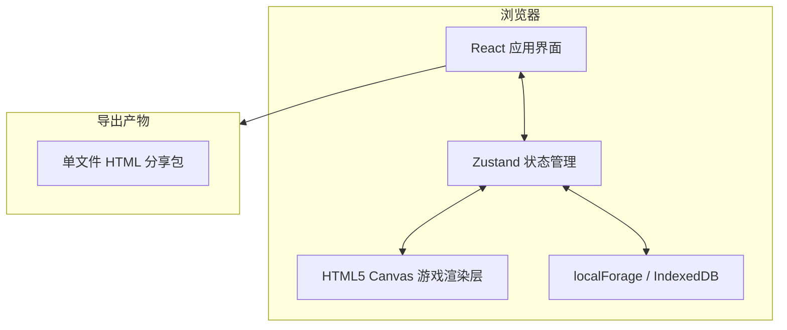
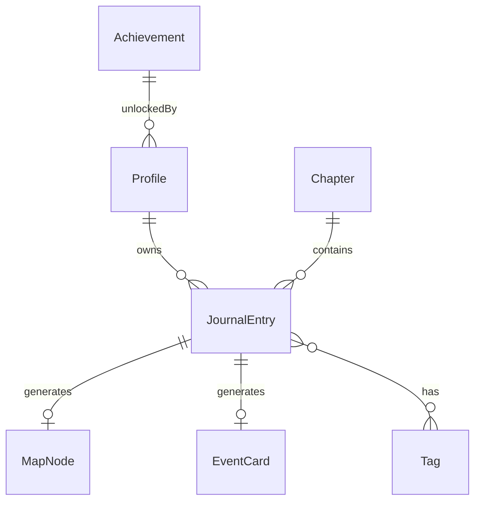

# Evertrail 技术架构文档

## 1. 架构设计



- 完全前端实现，无后端服务。
- 数据持久化在浏览器 IndexedDB，应用关闭后不会丢失。
- 导出分享包是离线可用的单 HTML 文件，内含数据与渲染逻辑。

## 2. 技术选型

| 层级 | 技术 | 说明 |
|------|------|------|
| 框架 | React 18 + TypeScript | 组件化 UI，类型安全 |
| 构建 | Vite 5 | 快速热更新与打包 |
| 样式 | Tailwind CSS 3 | 原子化样式，统一设计 token |
| 状态 | Zustand | 轻量全局状态，支持持久化中间件 |
| 本地存储 | localForage | IndexedDB 封装，存放大容量数据与图片 |
| 地图生成 | HTML5 Canvas + Simplex Noise | 程序化地形与生物群系 |
| 导出打包 | 原生 Blob/Data URL + 内联 JS | 单 HTML 文件，无需服务器 |
| 加密（可选） | Web Crypto API AES-GCM | 前端密码加密 |

- 不使用 Phaser 等大型游戏引擎，降低学习成本与包体积。
- 不使用外部后端/数据库服务，减少部署依赖。

## 3. 路由定义

| 路由 | 用途 |
|------|------|
| `/` | 旅程大厅（Dashboard） |
| `/journal` | 记录页（新建） |
| `/journal/:id` | 编辑指定记录 |
| `/map` | 人生地图全屏视图 |
| `/chapters` | 章节回忆列表 |
| `/chapters/:chapterId` | 单章节播放 |
| `/growth` | 成长与成就 |
| `/export` | 导出与分享 |

分享包为独立 HTML，不参与主应用路由。

## 4. 数据模型

### 4.1 实体关系



### 4.2 TypeScript 类型定义

```typescript
type Mood = 'joy' | 'calm' | 'sad' | 'angry' | 'tired' | 'anxious';

interface Profile {
  id: string;
  nickname: string;
  avatarSeed: string;
  level: number;
  xp: number;
  streak: number;
  lastCheckIn: string | null;
  createdAt: string;
}

interface JournalEntry {
  id: string;
  date: string; // ISO date
  text: string;
  mood: Mood;
  tags: string[];
  image?: string; // base64 data URL
  stats: {
    vitality: number;
    insight: number;
    connection: number;
    adventure: number;
  };
  rarity: number; // 1-5
  createdAt: number;
  updatedAt: number;
}

interface MapNode {
  id: string;
  entryId: string;
  index: number; // 在旅程中的顺序
  x: number;
  y: number;
  biome: string;
  seed: string;
}

interface Chapter {
  id: string;
  title: string;
  subtitle: string;
  startIndex: number;
  endIndex: number;
  entryIds: string[];
  themeColor: string;
  unlockedAt: number;
}

interface Achievement {
  id: string;
  name: string;
  description: string;
  icon: string; // SVG path 或 CSS class
  condition: (state: GameState) => boolean;
}
```

### 4.3 IndexedDB 存储设计

使用 localForage 创建 5 个 key-value/object 存储：

| Store | Key | Value |
|-------|-----|-------|
| `profile` | `'main'` | `Profile` |
| `entries` | `entry.id` | `JournalEntry` |
| `mapNodes` | `node.id` | `MapNode` |
| `chapters` | `chapter.id` | `Chapter` |
| `achievements` | `achievement.id` | `{ unlockedAt: number }` |

## 5. 关键模块职责

- `GameCanvas`：负责地图渲染、镜头控制、路标绘制、天气粒子。
- `EntryEditor`：表单状态、图片压缩、事件卡预览。
- `CardGenerator`：根据内容计算稀有度与属性。
- `ChapterEngine`：章节划分、标题生成、幻灯片流程。
- `AchievementEngine`：成就检测与解锁。
- `ExportBuilder`：序列化数据、生成独立 HTML、可选加密。

## 6. 非功能约束

- 所有数据不上传服务器，隐私优先。
- 单张图片限制 1MB，导出包大小建议不超过 5MB。
- 支持桌面 Chrome/Edge/Firefox/Safari；移动端以可访问为目标。
- 动画优先使用 requestAnimationFrame，UI 动画优先 CSS。

## 7. 开发阶段建议

| 阶段 | 目标 | 关键产出 |
|------|------|----------|
| MVP | 记录 + 事件卡 + 基础地图 | 可本地运行并看到路标 |
| 阶段 2 | 章节 + 成就 + 统计 | 完整的回顾体验 |
| 阶段 3 | 导出分享包 + 加密 | 可生成独立 HTML |
| 阶段 4 | polish | 动画、音效、移动端适配 |
