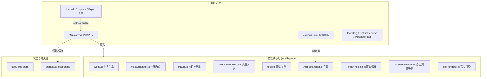
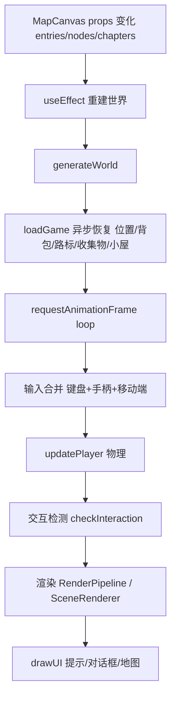
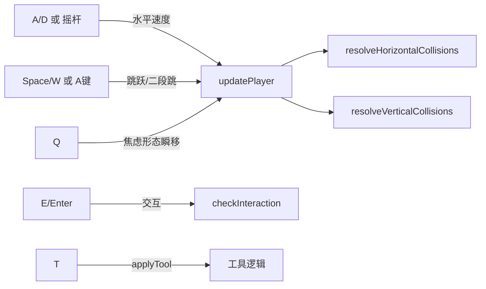
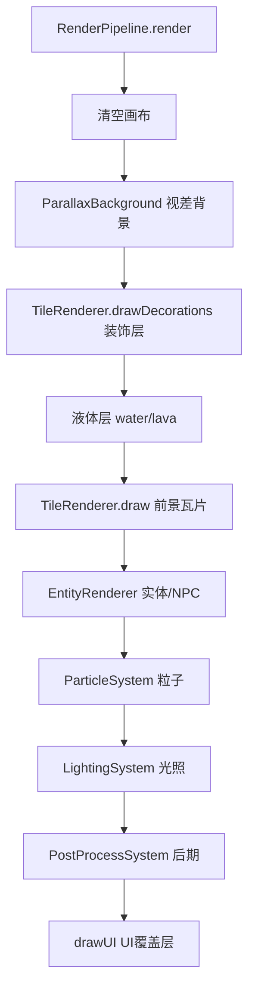
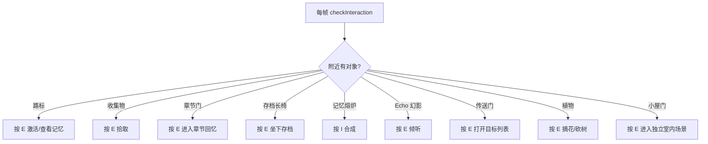
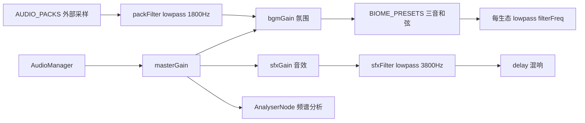
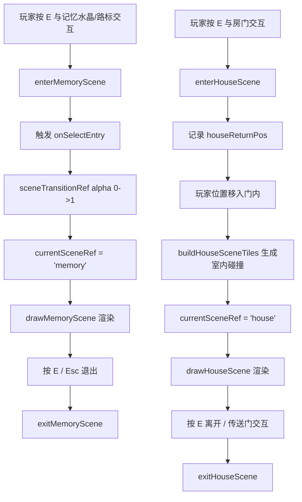

# Evertrail 技术架构与机制解析

> 本文档基于 `d:\Evertrail` 当前代码生成，覆盖世界生成、场景加载、玩家交互、渲染管线、音频、场景切换与持久化，并记录近期三个方向的优化实施结果。

---

## 1. 总体分层架构

---

## 2. 世界生成链路

关键代码：

- 节点生成：`generateMapNodes` 使用 `index * 160 + jitterX` 横向展开，`surfaceYAt` 基于 Simplex Noise 起伏。
  - 文件：`src/lib/mapGenerator.ts`
- 世界生成：`generateWorld` 按 `TILE_SIZE` 网格生成地表、地下、洞穴、水体、天空岛、岩浆层、遗迹房间，并在末尾生成玩家小屋。
  - 文件：`src/lib/game/World.ts`
- 交互对象：把日记标签映射为收集物、把稀有日记映射为 Echo 幻影、按章节起止节点生成 ChapterGate。
  - 文件：`src/lib/game/InteractiveObjects.ts`

---

## 3. 场景加载与主循环

- 主循环入口：`src/components/MapCanvas.tsx`
- 世界重建时机：依赖 `entries / nodes / chapters / size` 的 `useEffect`
- 存档恢复：`loadGame` 从 localforage 读取并回写 `playerRef / worldStateRef / entitiesRef`
- 场景状态：`currentSceneRef` 区分 `world | memory | house`，由 `sceneTransitionRef` 管理淡入淡出

---

## 4. 玩家控制与物理

- 物理与碰撞：`src/lib/game/Player.ts`
- 形态倍率与二段跳：`MapCanvas.tsx`
- 交互半径与优先级：`src/lib/game/InteractiveObjects.ts`

操作约束：

- 移动：`A/D` 左右，`Space/W` 跳跃。
- 交互：`E/Enter`（不与跳跃键共用）。
- 坐标对齐 `TILE_SIZE` 网格，避免碰撞穿透。

---

## 5. 渲染管线

- 世界渲染：`src/lib/game/RenderPipeline.ts`
- 记忆场景：`drawMemoryScene` 深渐变 + 中央光晕 + 打字机文本 + 照片
- 房屋场景：`drawHouseScene` 独立室内瓦片、装饰物、传送门、暗角
- 场景切换：全屏黑色淡入淡出由 `MapCanvas.tsx` 游戏循环绘制

---

## 6. 交互决策

当前交互逻辑集中在 `src/components/MapCanvas.tsx`。

---

## 7. 音频子系统

- 音频实现：`src/lib/game/AudioManager.ts`
- 频谱优化：和弦从 4 音减为 3 音，`filterFreq` 整体下调 25%~35%，`tempo` 降低约 15%
- 三套备选音频包：`synth`（默认合成器）、`nature`（自然声景）、`lofi`（轻缓 Lo-Fi）、`piano`（钢琴弦乐）
- 设置项：`settings.audioPack` 由 `SettingsPanel.tsx` 下拉选择

---

## 8. 场景切换子系统

- 记忆场景：深渐变背景 + 文字逐字显示 + 日记照片异步加载
- 房屋场景：独立室内坐标系、独立碰撞瓦片、装饰物与相框正确显示
- 过渡效果：`sceneTransitionRef` 控制 0.4s 黑色淡入淡出

---

## 9. 门元素设计与可达性

- 小屋门：`World.ts` 生成，门瓦片 `solid=false`，门前确保有固体地面
- 章节门：`InteractiveObjects.ts` 生成并绘制，视觉为发光拱门
- 可达性优化：门前铺设平台、增大交互半径、确保门中心与玩家站立高度匹配

---

## 10. 持久化

- 游戏状态：`saveGame / loadGame` 使用 localforage 存储 `player` / `worldState` / `entities`。
  - 文件：`src/lib/storage.ts`
- 设置：`saveSettings / loadSettings` 使用 localforage 存储。
  - 文件：`src/lib/settings.ts`

---

## 11. 关键文件索引

| 模块 | 文件 |
|------|------|
| 世界生成 | `src/lib/game/World.ts` |
| 地图节点 | `src/lib/mapGenerator.ts` |
| 玩家物理 | `src/lib/game/Player.ts` |
| 交互对象 | `src/lib/game/InteractiveObjects.ts` |
| 渲染管线 | `src/lib/game/RenderPipeline.ts` |
| 场景渲染 | `src/lib/game/SceneRenderer.ts` |
| 瓦片渲染 | `src/lib/game/TileRenderer.ts` |
| 音频 | `src/lib/game/AudioManager.ts` |
| 工具 | `src/lib/game/tools.ts` |
| 存档 | `src/lib/storage.ts` |
| 设置 | `src/lib/settings.ts` |
| 游戏画布 | `src/components/MapCanvas.tsx` |
| 类型定义 | `src/types/game.ts` |

---

## 12. 近期优化实施记录

### 12.1 背景音效优化
- 降低 `BIOME_PRESETS` 中 `filterFreq` 与 `tempo`，减少高频成分与听觉疲劳
- 新增 `AUDIO_PACKS` 与 `setAudioPack` 切换机制
- 设置面板增加“背景音乐包”下拉框

### 12.2 传送与场景切换重构
- 记忆水晶交互后进入独立 `memory` 场景，由 `drawMemoryScene` 渲染
- 房屋门交互后进入独立 `house` 场景，由 `drawHouseScene` 渲染
- 移除旧版“传送”效果，改为全屏淡入淡出过渡
- 室内相框图片通过 `loadSceneImage` 异步加载并绘制

### 12.3 门元素设计与可达性优化
- 重绘小屋门、室内门、章节门视觉细节
- 生成小屋时确保门前有固体平台/台阶
- 增大房门交互半径，使玩家可自然走至门前交互
- 提供角色移动与门可达性测试方案（见下节）

---

## 13. 角色移动与门可达性测试方案

### 13.1 测试环境
- 浏览器：Chrome / Edge / Firefox 最新版
- 输入设备：键盘（A/D + Space/W + E/Enter）、手柄、触摸（移动端虚拟按键）
- 测试入口：新建一篇日记后进入地图，或读取已有存档

### 13.2 测试前置条件
1. 成功生成世界并出现玩家小屋（地图最右侧节点左侧）。
2. 玩家出生点距离小屋不超过 10 格，便于步行验证。
3. 控制台无 `createRadialGradient` 非有限坐标报错。

### 13.3 测试用例

| 编号 | 测试项 | 操作步骤 | 预期结果 | 通过标准 |
|------|--------|----------|----------|----------|
| D-01 | 正常移动 | 按住 A/D 左右移动 | 角色平滑左右移动，动画与朝向正确 | 无明显卡顿或反向 |
| D-02 | 跳跃接近 | 在门前按 Space/W 跳跃 | 角色可跳上门前台阶/平台 | 落在门前平台后站稳 |
| D-03 | 房门提示 | 走至门前 1~2 格内 | 屏幕底部出现“按 E 进入小屋” | 提示稳定显示不闪烁 |
| D-04 | 进入小屋 | 在提示出现时按 E/Enter | 屏幕淡出 → 进入独立室内场景 | 看到室内地板、墙壁、默认家具 |
| D-05 | 离开小屋 | 在室内靠近门口按 E/Enter | 屏幕淡出 → 回到门外记录点 | 玩家出现在门外平台 |
| D-06 | 多角度接近 | 从门左侧、右侧、正前方分别接近 | 均出现提示并可进入 | 三个方向均通过 |
| D-07 | 跳跃中交互 | 在门前起跳过程中按 E | 不触发进入（避免误触） | 落地后再次按 E 才进入 |
| D-08 | 章节门可达 | 找到发光拱门并走至门下 | 出现“按 E 进入章节回忆” | 可进入章节页面 |
| D-09 | 记忆水晶交互 | 靠近路标/记忆水晶 | 出现“按 E / 点击 查看回忆” | 进入记忆场景并显示日记内容 |
| D-10 | 手柄支持 | 使用手柄左摇杆移动，A/X 跳跃，X/B 交互 | 与键盘体验一致 | 所有门可正常进出 |

### 13.4 调试辅助
- 浏览器控制台可访问 `window.__EVERTRAIL_DEBUG__` 查看玩家、门、路径点实时位置。
- 在 `MapCanvas.tsx` 中临时增大 `nearHouseDoor` 阈值可用于快速定位是否为距离问题。
- 开启地图（M）可确认小屋位置与玩家相对位置。

### 13.5 失败排查清单
1. 若无法走到门前：检查 `World.ts` 门前是否生成 `platform` 瓦片；检查是否有地形阻挡。
2. 若提示不出现：检查玩家中心与门中心距离是否小于 `TILE_SIZE * 2.0`。
3. 若进入后黑屏：检查 `SceneRenderer.drawHouseScene` 是否正常执行；检查 `houseSceneTilesRef` 是否非空。
4. 若离开小屋位置错误：检查 `houseReturnPosRef` 是否在 `enterHouseScene` 时被正确记录。
