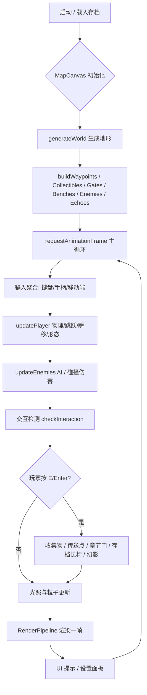
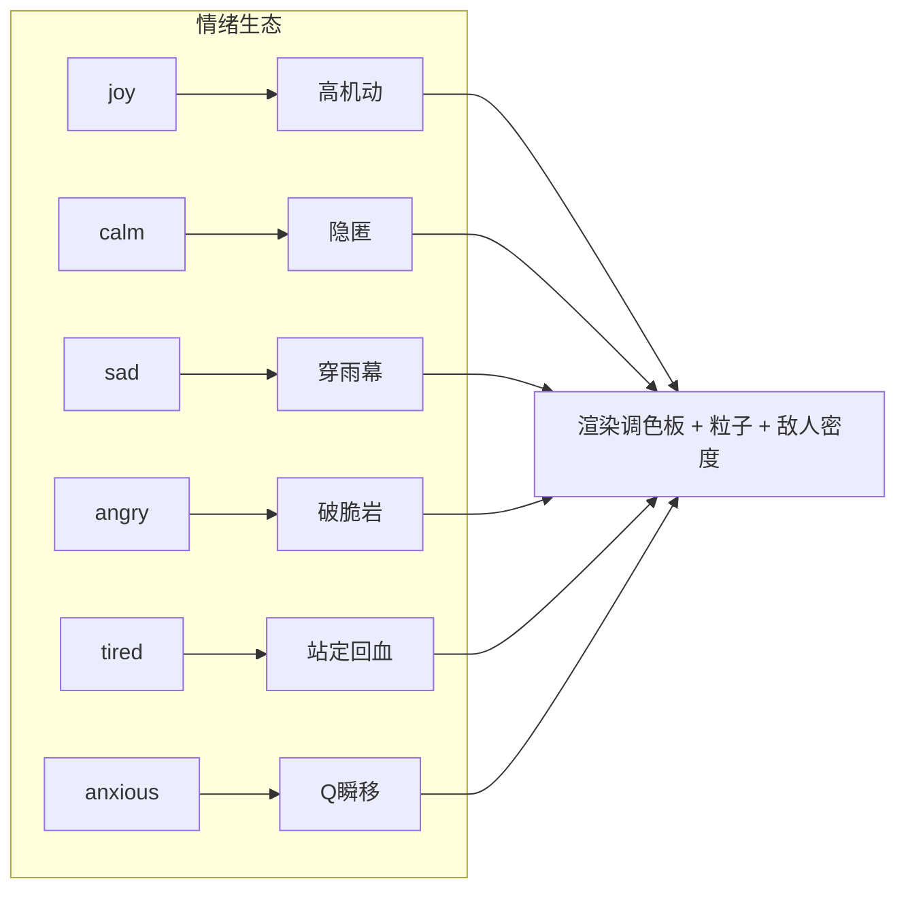
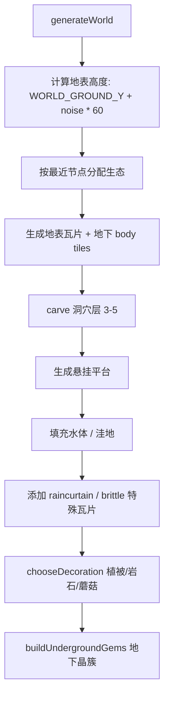
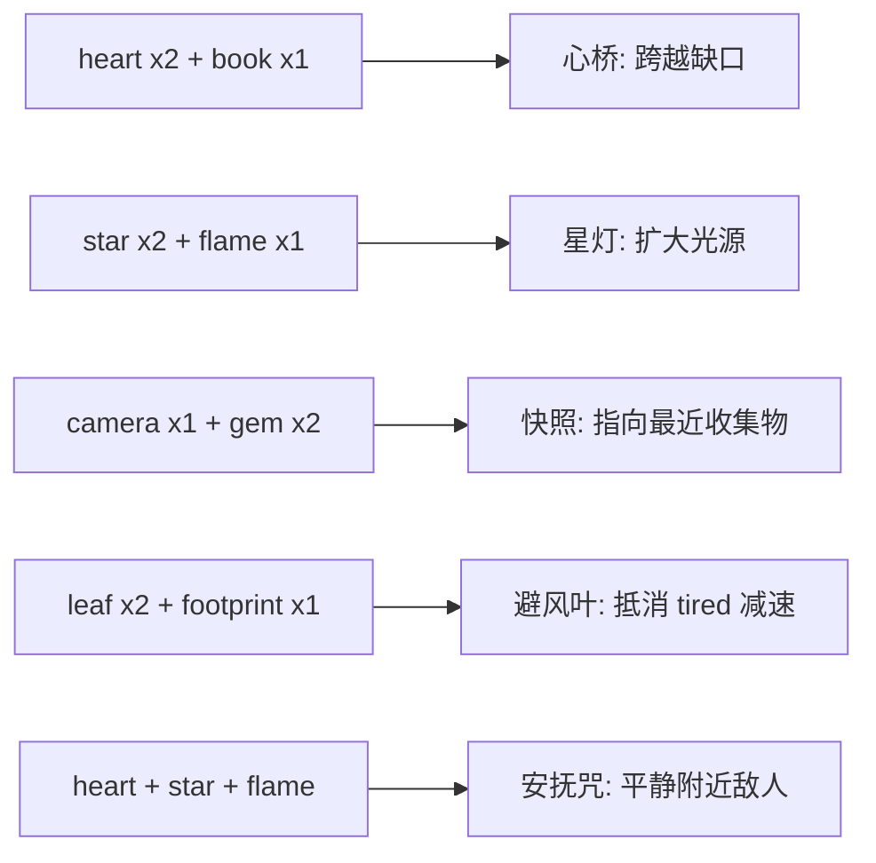

# Evertrail 游戏机制图解、泰拉瑞亚对比与优化计划

## 1. 计划概要

本计划目标：
1. 用结构化图解（Mermaid + 文字说明）梳理当前 Evertrail 的核心游戏机制与代码实现路径。
2. 将 Evertrail 与 Terraria 的关键机制做逐项对比，明确“已具备 / 差距 / 不应照搬”三类内容。
3. 提出向 Terraria 风格演化、同时保留 Evertrail 叙事-情绪特色的阶段性优化路线。
4. 明确美术（程序生成像素画 / 手绘素材）需求与投入建议。

执行方式：以只读分析为主，不直接修改业务代码；最终输出为可指导后续开发的设计文档与任务清单。若用户批准，可进入第二阶段进行原型实现。

## 2. 当前机制全景（基于代码分析）

### 2.1 技术栈与入口

- **框架**：React 18 + Vite + TypeScript + TailwindCSS + Zustand。
- **游戏循环**：`src/components/MapCanvas.tsx:706-1352` 的 `requestAnimationFrame` 主循环，所有高频状态放在 ref 中，避免 React 重渲染。
- **渲染管线**：`src/lib/game/RenderPipeline.ts:51` 按顺序绘制：清空 → 视差背景 → 装饰层 → 液体层 → 前景瓦片 → 实体/NPC → 粒子 → 光照（multiply） → 后期处理 → UI。
- **世界生成**：`src/lib/game/World.ts:54` 基于 Simplex Noise 与固定种子生成地表起伏、地下洞穴、水体、平台、特殊瓦片（脆岩 / 雨幕）。
- **输入**：键盘 A/D、Space/W、E/Enter、Q（焦虑瞬移）；手柄与移动端虚拟按键；鼠标拖拽相机后，玩家移动自动恢复跟随（`MapCanvas.tsx:839-841`）。

### 2.2 核心机制流程图

### 2.3 情绪生态（Mood/Biome）系统

当前 6 种生态对应玩家日记 mood，每种生态有独立调色板、敌人密度、被动效果：

| 生态 | 主机制 | 特殊瓦片/敌人 | 被动效果（`constants.ts:16-59`） |
|---|---|---|---|
| joy | 高速高跳 | 无特殊瓦片 | speedMul 1.15 / jumpBonus 1.2 |
| calm | 基准态 | 敌人侦测半径减半 | 无数值变化 |
| sad | 穿雨幕 | raincurtain 瓦片 | speedMul 0.9 / 雨幕可通行 |
| angry | 破坏脆岩 | brittle 瓦片 | 可破坏脆岩障碍 |
| tired | 站定回血 | golem 敌人 | speedMul 0.75 / 静止恢复光芒 |
| anxious | 短距离瞬移 | wisp 敌人 | 按 Q 瞬移 48px |

### 2.4 世界生成层次

### 2.5 实体与交互对象

- **玩家**：`Player.ts:27-43`，20×28 px，程序绘制像素小人，支持行走动画、跳跃、水中物理、形态颜色变化。
- **传送点 Waypoint**：`InteractiveObjects.ts:52-72`，最后节点为“篝火”形态，其余为“石碑”，激活后恢复光芒。
- **收集物 Collectible**：`InteractiveObjects.ts:74-111`，根据日记标签生成 book / camera / footprint / heart / star / leaf / flame / gem 八种。
- **章节门 ChapterGate**：`InteractiveObjects.ts:177-203`，由章节起止节点生成的大型拱门，进入章节回忆。
- **存档长椅 SaveBench**：`InteractiveObjects.ts:205-231`，坐 1 秒保存并恢复光芒。
- **幻影 Echo**：`InteractiveObjects.ts:141-175`，稀有/长文本日记生成的可对话 NPC，解锁隐藏章节。
- **敌人 Enemy**：`EnemyAI.ts`，wisp（追踪）、hound（巡逻/冲锋）、mist（范围减速+光芒流失）、golem（沉睡/追击）。

### 2.6 合成与背包

`src/lib/game/crafting.ts:12-53` 当前 5 种配方：

## 3. 与 Terraria 的对比

### 3.1 核心相似点（Evertrail 已具备 Terraria 的“骨架”）

| 维度 | Evertrail 现状 | Terraria 典型特征 |
|---|---|---|
| 2D 平台探索 | ✓ 横向 + 纵向（天空 -400 ~ 地下 800） | ✓ 多层世界：地表/地下/洞穴/地狱 |
| 程序化地形 | ✓ Simplex Noise 地表 + 洞穴 | ✓ 随机生成地形、洞穴、结构 |
| 生物群系 | ✓ 6 种情绪生态，调色板/敌人/机制不同 | ✓ 森林/沙漠/丛林/腐化/雪地等 |
| 收集物 | ✓ 地表/地下散落，带标签语义 | ✓ 大量矿石/材料/宝箱/Heart Crystal |
|  crafting | ✓ 5 种配方，被动/限时/即时效果 | ✓ 工作台/熔炉/砧等多级合成 |
| 光照系统 | ✓ 玩家光源 + 月光 + 收集物辉光 | ✓ 火把/荧光棒/夜光蘑菇等动态光源 |
| 敌人 AI | ✓ 巡逻/追踪/范围 debuff | ✓ 丰富 AI，事件/BOSS 战 |
| 存档点 | ✓ 长椅休息存档 | ✓ 床 / 水晶设置重生点 |

### 3.2 关键差距（按影响排序）

| 差距项 | 当前实现 | Terraria 标准 | 优化价值 |
|---|---|---|---|
| **可挖掘/放置方块** | 瓦片只读，仅 angry 能破坏脆岩 | 玩家可任意挖掘、放置、塑形世界 | 极高，这是“沙盒感”核心 |
| **工具与武器** | 无 | 镐/斧/剑/弓/法杖等工具链 | 高 |
| **BOSS / 事件** | 无 | 大型遭遇战、入侵事件 | 中 |
| **物理破坏与连锁** | 脆岩单独破坏，无连锁 | 爆炸、流体、重力方块 | 中 |
| **NPC 城镇与生态** | Echo 为纯叙事 | NPC 入住、商人、向导 | 中 |
| **装备与属性成长** | 仅背包与合成 | 护甲、饰品、属性树 | 中 |
| **钓鱼/农业/电路** | 无 | 生活系统 | 低（与情绪叙事关联弱） |
| **多人联机** | 纯单机 | 多人合作/对战 | 低 |

### 3.3 不应照搬 Terraria 的设计

1. **世界观核心**：Evertrail 是“情绪日记”驱动的隐喻世界，不应变成纯资源采集-装备数值游戏。
2. **控制复杂度**：当前 A/D + Space + E + Q 足够轻量，Terraria 的鼠标挖掘/放置会大幅增加操作复杂度。
3. **战斗主导**：Terraria 有大量战斗与 BOSS；Evertrail 应让敌人成为“情绪阴影”的隐喻，而非掉落驱动的farm目标。
4. **世界无限改造**：完全开放挖掘会破坏日记节点精心布置的关卡节奏。

## 4. 优化路线：向 Terraria 风格演化，保留 Evertrail 特色

### 4.1 设计原则

- **保留**：情绪生态作为核心差异；日记节点驱动的叙事关卡；轻量控制；光芒/回忆作为资源隐喻。
- **借鉴 Terraria**：多层垂直世界、可交互环境、工具-材料循环、动态事件、更具威胁的敌人遭遇。
- **新增**：有限度的环境改造（“情绪工具”而非通用镐子），让探索从“走路看风景”升级为“与环境对话”。

### 4.2 第一阶段：环境交互扩展（4-6 周）

目标：在不破坏叙事布局的前提下，让玩家能用“情绪工具”有限改造世界。

| 功能 | 实现文件 | 具体改动 |
|---|---|---|
| 情绪工具系统 | `src/lib/game/tools.ts`（新建） | 基于当前 mood 自动装备一种工具：joy-光镐（破坏普通瓦片）、sad-雨铲（填平小坑/引水）、angry-碎岩锤（破坏 brittle 与大范围脆岩）、anxious-相位铲（穿透一堵墙）、calm-安抚杖（平静敌人/让植物生长）、tired-扎根杖（原地生成临时平台）。 |
| 工具热键 | `MapCanvas.tsx:108` 增加 `tool` 键位 | 默认鼠标左键或 T 键触发；移动端增加工具按钮。 |
| 有限耐久/能量 | `Player.ts` 增加 `toolEnergy` | 使用工具消耗光芒或形态能量，休息/收集物恢复，避免无限改造。 |
| 可破坏普通瓦片 | `World.ts` + `TileRenderer.ts` | 将地表 grass/dirt/stone 标记为可破坏；破坏后掉落对应材料。 |
| 水体互动 | `World.ts` + `RenderPipeline.ts` | sad 工具可临时改变水方块高度或生成雨幕；angry 工具可蒸发小片水域。 |

### 4.3 第二阶段：材料-合成循环扩展（3-4 周）

目标：让收集物从“一次性光芒恢复”变成“叙事材料”。

| 功能 | 实现文件 | 具体改动 |
|---|---|---|
| 材料掉落 | `InteractiveObjects.ts` + `World.ts` | 破坏瓦片/敌人 calm 后掉落 shard（情绪碎片），与现有 8 种收集物合并为材料体系。 |
| 配方扩展 | `crafting.ts` | 新增“情绪灯塔”（永久点亮黑暗区域）、“记忆锚”（设置临时存档点）、“共鸣笛”（召唤附近 Echo）、“雨披”（永久免疫 mist 减速）等。 |
| 合成台 | `Entity.ts` + `MapCanvas.tsx` | 在节点附近生成“记忆熔炉”实体，靠近后打开扩展合成面板。 |
| 装备槽 | `types/game.ts` + `Player.ts` | 增加 3 个饰品槽，装备后改变被动效果（如 joy 时二段跳）。 |

### 4.4 第三阶段：动态事件与 BOSS（4-5 周）

目标：引入 Terraria 式的事件节奏，但包装为情绪危机。

| 功能 | 实现文件 | 具体改动 |
|---|---|---|
| 情绪风暴事件 | `src/lib/game/events.ts`（新建） | 在玩家停留过久或触发特定 Echo 后，当前生态进入“风暴”：敌人密度提升、视野缩小、出现稀有收集物。 |
| 章节 BOSS | `EnemyAI.ts` + `Entity.ts` | 每个章节末尾生成“阴影化身”，有阶段变化（如 angry 生态的火焰巨像、anxious 生态的分身幽灵）。 |
| 事件音乐与屏幕特效 | `PostProcessor.ts` + `AudioManager.ts` | 风暴期间启用红色/紫色 vignette、屏幕抖动、低频音效。 |

### 4.5 第四阶段：垂直世界深化（3-4 周）

目标：让天空与地下更有意义。

| 功能 | 实现文件 | 具体改动 |
|---|---|---|
| 天空层 | `World.ts` | 在 y < WORLD_GROUND_Y - 200 生成漂浮岛屿、云层平台、天空收集物。 |
| 更深地下 | `World.ts` | 在 y > 800 增加岩浆层、遗迹房间、稀有矿石。 |
| 快速旅行 | `InteractiveObjects.ts` | 激活的 Waypoint 之间可传送，类似 Terraria 晶塔网络。 |
| 世界地图 | `Map.tsx` + `MapCanvas.tsx` | 按 M 打开缩略地图，显示已探索区域与节点。 |

## 5. 美术需求评估

### 5.1 当前美术现状

- **全部程序绘制**：玩家、敌人、瓦片、树木、UI 均由 Canvas 2D 代码实时绘制，无外部精灵图。
- **优势**：包体小、风格统一、换色容易、与情绪生态系统天然契合。
- **瓶颈**：复杂动画（攻击、受击、BOSS 多阶段）用代码绘制成本极高；像素精度受 Canvas 抗锯齿影响。

### 5.2 是否需要外部美术？

**结论：短期不需要；中期建议引入少量手绘/像素素材用于关键角色与 BOSS。**

| 元素 | 当前方式 | 建议 |
|---|---|---|
| 瓦片 / 地形 / 装饰 | 程序绘制足够 | 保持，节约资源 |
| 玩家角色 | 程序绘制 20×28 像素人 | 中期可改为精灵表，增加攻击/受击/工具使用动画 |
| 敌人 | 程序绘制几何图形 | 普通敌人保持；BOSS 建议手绘像素图 |
| 粒子/光效 | 程序生成 radial gradient | 保持，可扩展预设 |
| UI | Tailwind + PixelButton 组件 | 保持，必要时增加手绘边框/图标 |
| 过场/插图 | 无 | 叙事节点可增加 AI 生成或手绘情绪插画 |

### 5.3 若做工具/武器扩展的美术需求

- 每种情绪工具需要 1 个图标 + 1 个挥动/释放特效：
  - 图标可用 Lucide + 染色，无需手绘。
  - 挥动特效可用粒子系统 + 简单几何轨迹，无需素材。
- BOSS 若引入，建议每个 BOSS 1 套精灵表（ idle / 蓄力 / 攻击 / 受击 / 死亡），约 5-8 帧。

## 6. 验证与验收标准

| 阶段 | 可验证产出 |
|---|---|
| 探索完成 | 本计划文档 + 机制图解 |
| 第一阶段 | 玩家能在 joy/sad/angry 等形态下使用工具破坏/改造环境，且不破坏节点布局；新增单元测试覆盖 `tools.ts` 与 `World.ts` 瓦片变更。 |
| 第二阶段 | 合成面板出现新配方，材料掉落与收集物系统打通；`npm run check` 与 `npm run lint` 无错误。 |
| 第三阶段 | 触发情绪风暴后敌人数增加、屏幕特效变化；至少完成 1 个章节 BOSS 原型。 |
| 第四阶段 | 天空/地下有可探索内容，Waypoint 间可传送；游戏在桌面与移动端均可正常运行。 |

## 7. 下一步建议

1. **若批准本计划**：进入实现阶段，先完成第一阶段“情绪工具系统”的最小可行原型（ joy 光镐破坏 grass/dirt，掉落材料）。
2. **若需先体验**：在本地运行 `npm run dev`，进入地图模式录制一段实际游玩视频/截图，用于补充当前手感与视觉差距分析。
3. **若范围需收窄**：可仅先做“机制图解文档”与“美术需求清单”，暂缓代码实现。
